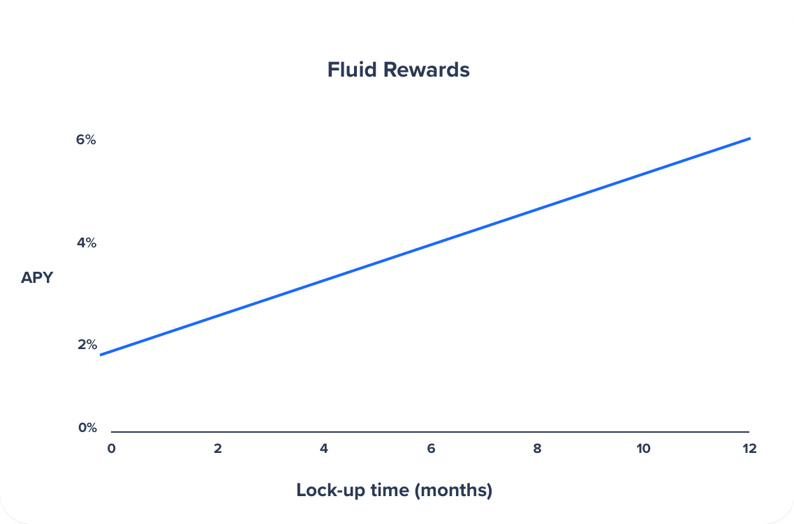

# How to stake FTM

Participate in staking to secure Fantom network and earn FTM tokens as a reward. To stake, you don’t need any particular hardware or device. You can do it directly from your phone or PC.

1- Open the [Fantom fWallet](https://pwawallet.fantom.network/#/) from your computer or your mobile device. Create a new wallet, or access an existing one using mnemonic or a keystore file.

2- Navigate to “Staking” on the left and then click on the “Add Delegation” button.\
.jpeg>)

3- Select a validator node and enter the amount of FTM you’d like to delegate and then submit the transaction.\

4- Click on your delegation to see more details.

5- In the delegation details section click on the “Lock Delegation” button.

.jpeg>)

6- Choose to lock-up your tokens for a reward rate proportional to the lock-up period. The longer period, the more rewards. Then click on the “Ok, Lock” button and then submit the transaction.\
.jpeg>)\
\
\

It's finished. Enjoy your staking rewards. Also, you can use your staked amount as collateral on the fMint by minting sFTM.&#x20;
