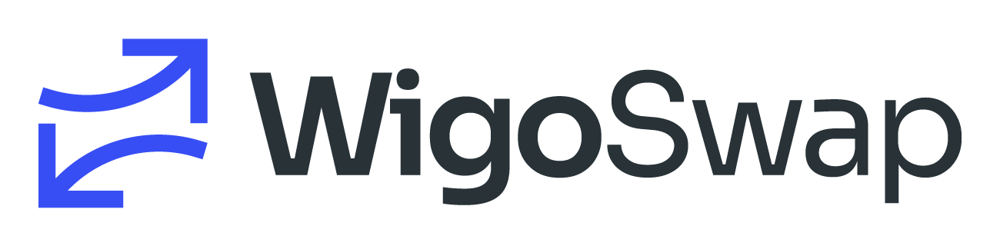
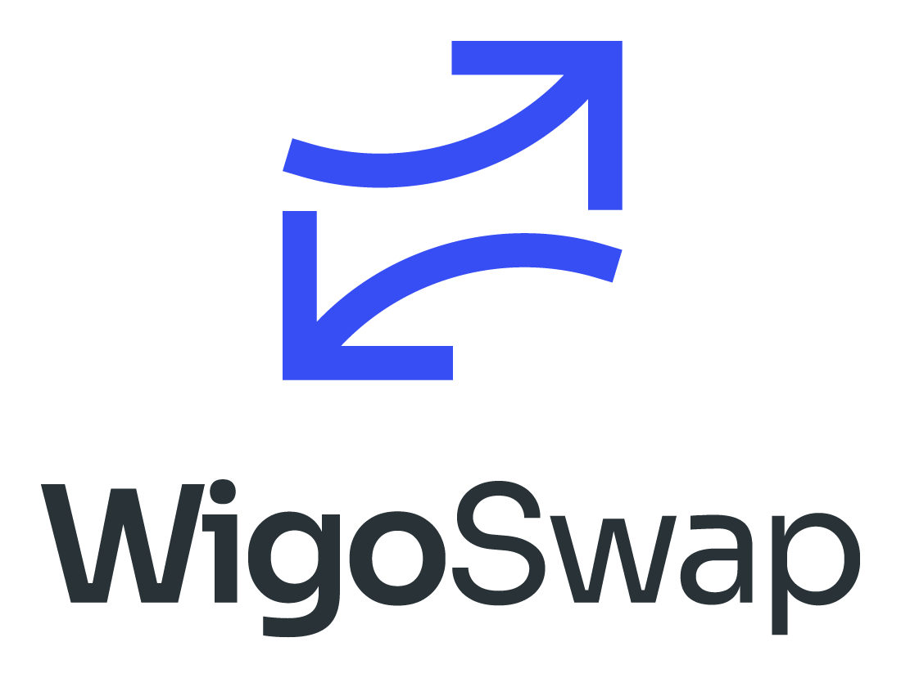
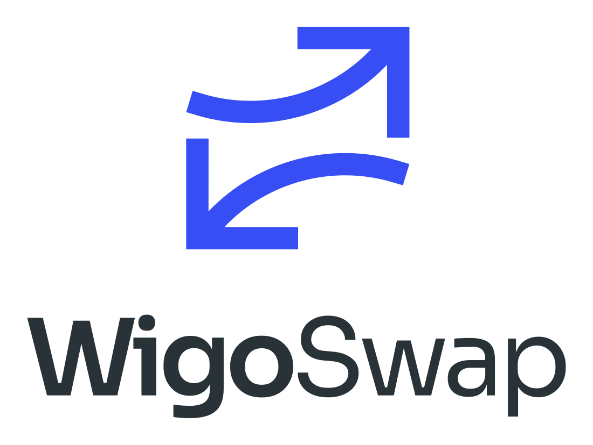
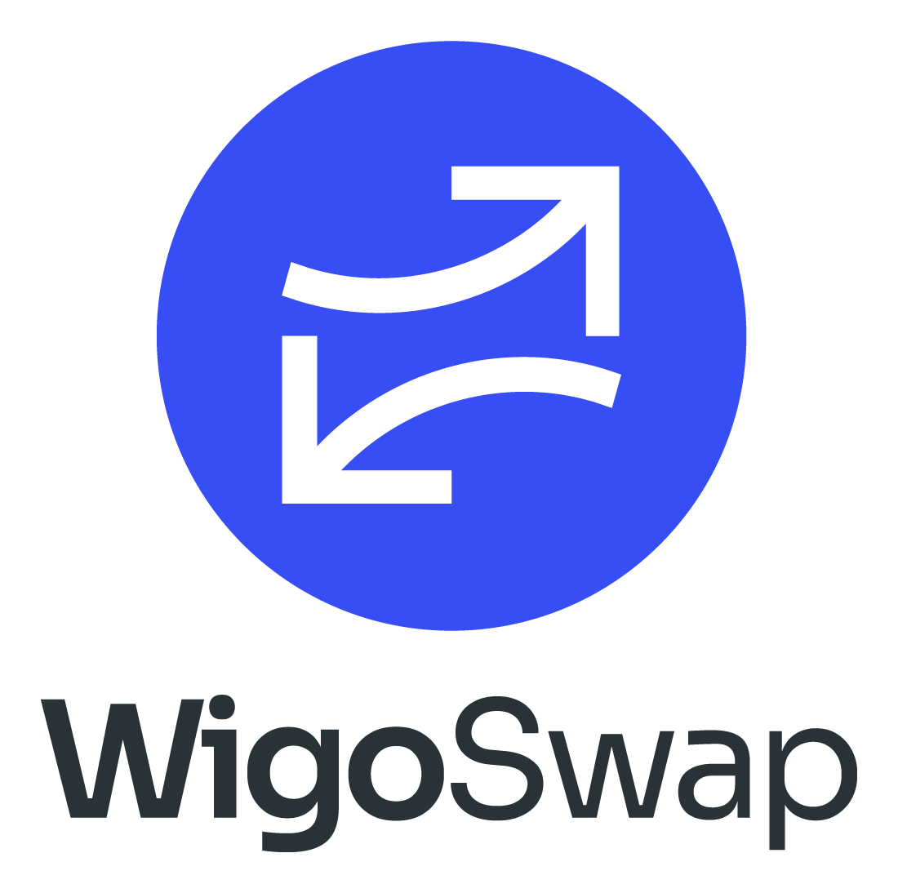
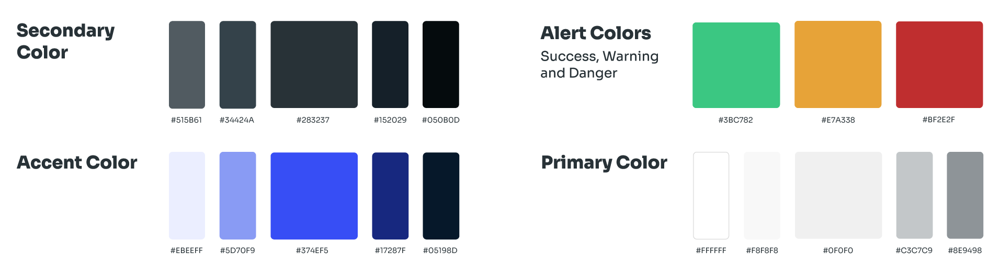

# ⏬ Brand & Logos

You may use WigoSwap's Brand Assets when you are:

* Referring to our products and services
* Linking to our official site or products, such as "Trade our token on WigoSwap"
* Announcing an official partnership, but only if you have an **Official Approval** by a qualified member of the WigoSwap team

> Logo - Horizontal PNG | SVG

          

> Logo - Vertical PNG | SVG

          

> Logo - Coin Mode PNG | SVG

          

> WIGO Coin PNG | SVG

&#x20;    

> WIGO Icon PNG | SVG

&#x20;    

