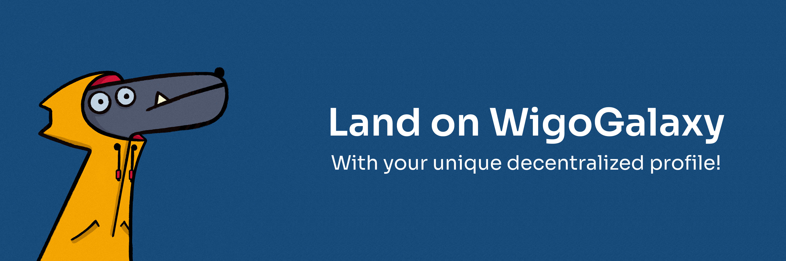
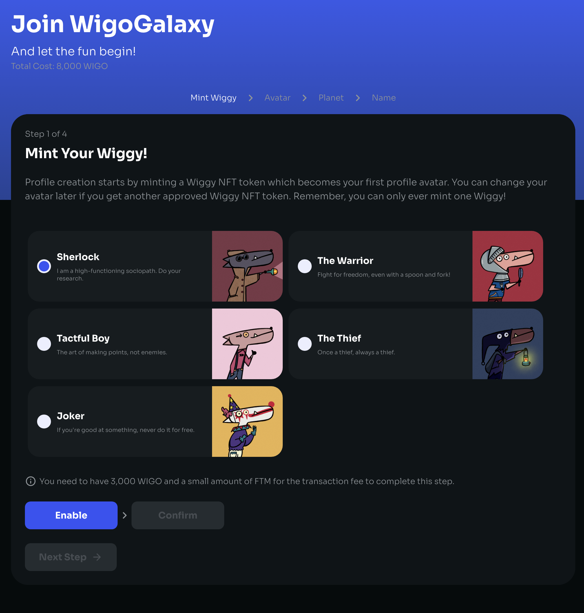
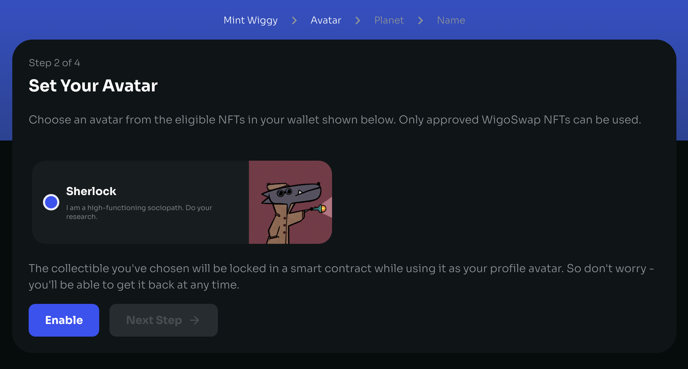
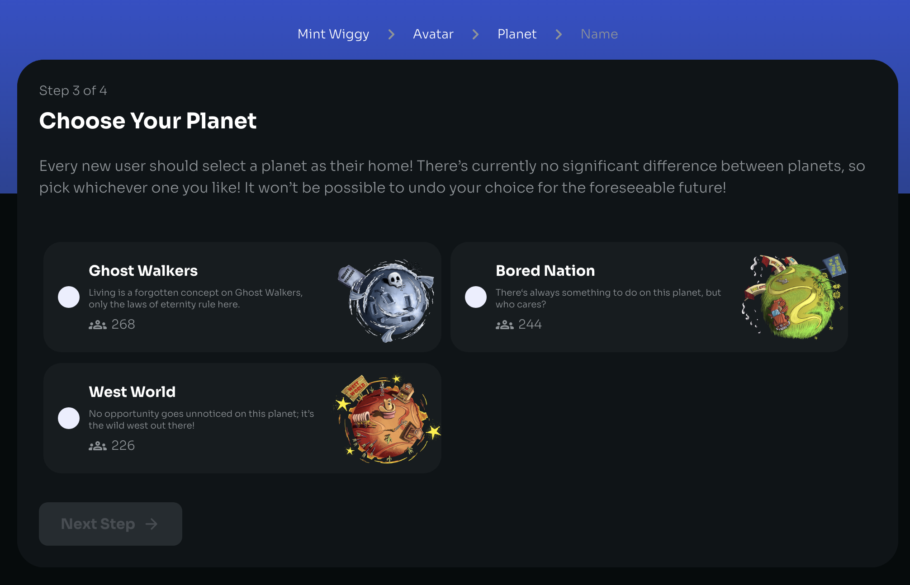
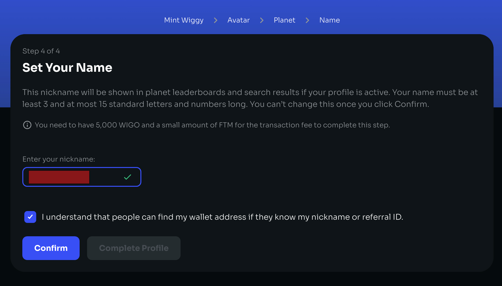

# How to create profile

<figure><figcaption></figcaption></figure>

Creating a decentralized user profile on WigoSwap is an exciting and unique feature. Each wallet can have a user profile on WigoSwap and benefit from various features of the platform. It is necessary to have an active user profile to use different sections, including the referral system, participating in games and lotteries, claiming achievements, etc. Also, in the process of creating a user profile, a cool Wiggy will be minted according to your choice, and you will join the group of owners of this attractive NFT. Currently, the cost of creating each user profile (including minting a Wiggy) costs 8000 $WIGO, all of which is burned through the [GBM](../tokenomics/gamified-burning-mechanism-gbm.md). If you have referred to WigoSwap through another profile, a portion of this fee will be awarded to the person who introduced you as a bonus in the referral system.


**To start creating a user profile on WigoSwap please open this** [**link**](https://wigoswap.io/join)**.**&#x20;


\
<mark style="color:blue;">**Step 1: Minting your Wiggy (NFT Avatar)**</mark>

After connecting your wallet you should see a list of available Wiggies that you can mint in the process and choose as your profile avatar. Select whichever you like most! Click on “Enable” to give access to WigoSwap to interact with your wallet. After that click on “Confirm” to confirm the process in your wallet.&#x20;

<figure><figcaption></figcaption></figure>

\
<mark style="color:blue;">**Step 2: Selecting Wiggy as your avatar**</mark>

Now you have successfully minted and owned your Wiggy, next you can see your Wiggy and select it as your profile pic. In this step by clicking on “Enable” you will lock your NFT on WigoSwap to be able to use it as your avatar. Don’t worry, you can unlock it whenever you want. Now click on the next step.

<figure><figcaption></figcaption></figure>

\
<mark style="color:blue;">**Step 3: Choosing your planet!**</mark>

Creating a profile on WigoSwap is in fact the process of joining WigoGalaxy, so every new user should select a planet as their home! There’s currently no significant difference between planets, so pick whichever one you like! It won’t be possible to undo your choice for the foreseeable future!

<figure><figcaption></figcaption></figure>

\
\
<mark style="color:blue;">**Step 4: Choose your nickname**</mark>

What should we call you on WigoGalaxy? Choose your preferred username. This nickname will be shown in planet leaderboards and search results if your profile is active. Your name must be at least 3 and at most 15 standard letters and numbers long. You can’t change this once you click Confirm.

<figure><figcaption></figcaption></figure>


**Note: People can find my wallet address if they know my nickname or referral ID. So please be careful about this and agree with that by enabling the warning check box.**&#x20;


\
\
Click “Confirm” to approve your username through your wallet. Your username is submitted and the last action is clicking on “Complete Profile” → “Enable” & “Confirm” to pay the profile creation fee. \

\
**Congrats! Your WigoGalaxy profile is now live! Enjoy.**\
