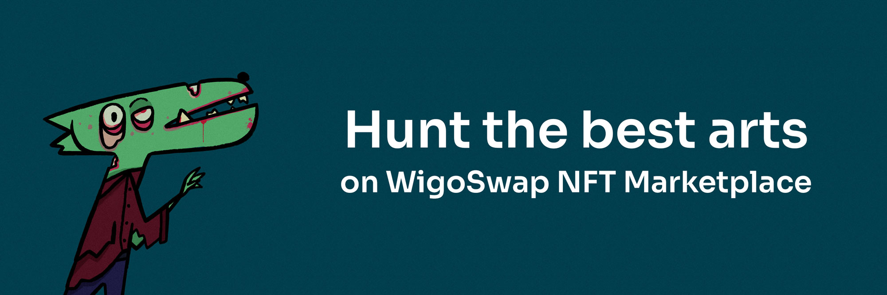
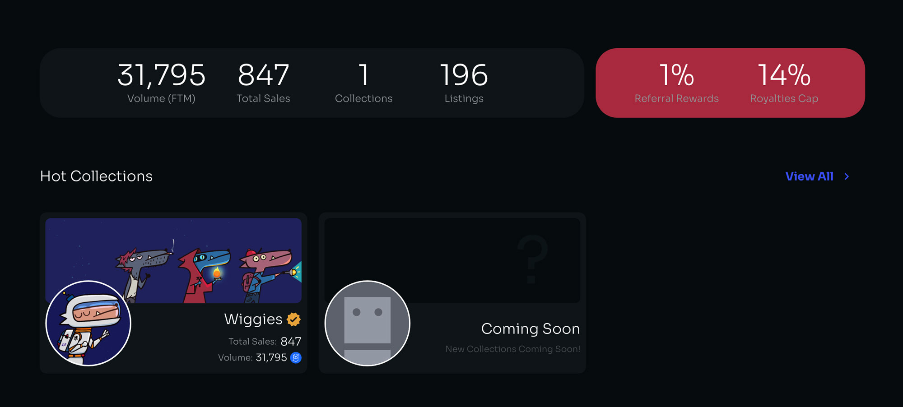

# 🖼 NFT Marketplace (WigoMarket)

<figure><figcaption></figcaption></figure>

> **We believe in art & not only try to be good artists ourselves in the development of our products but also to help great artists expose their works in the best way possible.**

\
WigoSwap NFT Marketplace is a place to offer valuable and lasting artworks on the Fantom Network. Various artists can present their collections to our audience.

<figure><figcaption></figcaption></figure>


**It is necessary to note that we prefer to place collections in the marketplace that have a high artistic value and unfortunately we cannot accept all artists' works at the moment. If you want your NFT collection to be published on the WigoSwap marketplace, please contact us through our BD Telegram account:**

\
[**Aaron (Partnerships and Marketing)**](https://t.me/AaronLeb)

