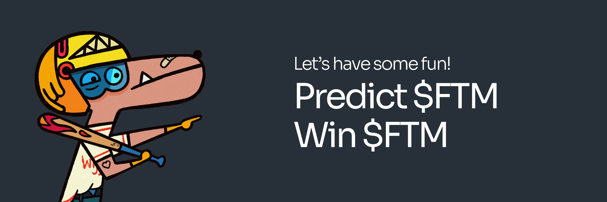

# 🎮 Predict Mini-Game

At the intersection of DeFi and gaming, Predict is a feature-rich, engaging mini-game available on the WigoSwap platform. In Predict, players have the opportunity to make educated predictions about the price movement of various cryptocurrencies. By studying market trends and leveraging their crypto knowledge, players can earn substantial rewards for accurate predictions. Whether you're a seasoned crypto veteran or a novice trader, Predict offers an exciting, dynamic environment for you to test your market knowledge.

Predict isn't just about making predictions — it's a social experience that fosters community engagement. Players can track their performance, climb leaderboards, and even challenge friends. Predictions are made in a fair and transparent way, using smart contracts on the Fantom blockchain, ensuring that every prediction is tamper-proof and verifiable. So, step into the world of Predict and pit your forecasting skills against the crypto market!

Please note, though engaging and rewarding, Predict is a game that involves risk. We advise all users to understand the game rules thoroughly, practice responsible gaming, and only play with funds they are prepared to risk.


There is just one rule: Predict FTM price (green/up or red/down) and win!


### &#x20;How to participate?

&#x20;It's really easy:

1. Predict if the price of FTMUSD will be higher or lower than it was when the live phase starts.
2. If you enter a “GREEN” position, and the “Closed Price” is higher than the “Locked Price” at the end of the 5-minute live phase, you WIN! And if it’s lower, you lose.
3. If you enter a “RED” position, and the “Closed Price” is higher than the “Locked Price” at the end of the 5-minute live phase, you LOSE! If it’s lower, you win.
