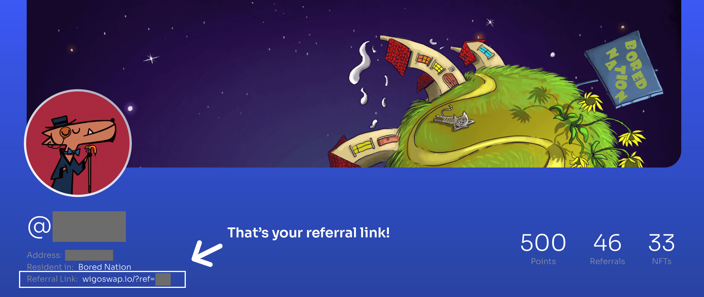
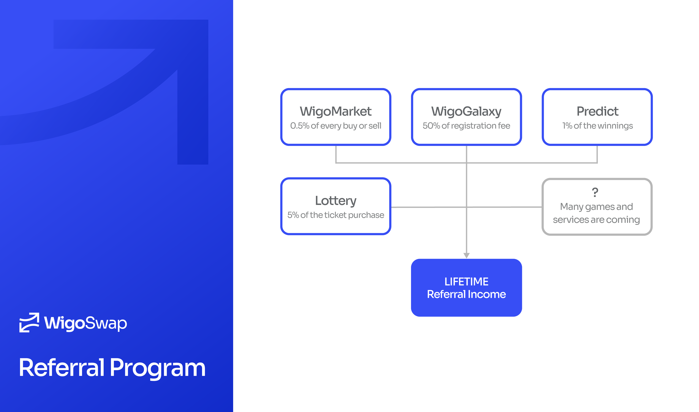

# 💸 Referral System

<figure><figcaption></figcaption></figure>

We have designed one of the most unique, complete, and efficient referral systems in the DeFi world and are continuously developing it. Every user who uses WigoSwap can easily get his own referral link by creating a user profile and inviting his friends through it.&#x20;


You can see the traces of the referral system in almost all parts of WigoSwap, including [WigoGalaxy](user-profile-system-wigogalaxy/), WigoMarket, the [PREDICTION](predict-mini-game/) mini-game, and other parts that will be released in the future. If the person invited through you does any activity on the platform, a part of the commission or income will be assigned to you, forever!


To find your link and referral code, connect your wallet and go to your profile (don't have one yet? read [here](user-profile-system-wigogalaxy/how-to-create-user-profile.md)) page after registering a user profile in WigoSwap.

<figure><figcaption>
Every new user that registers on WigoSwap through your referral link will make you money for the rest of your life!
</figcaption></figure>

**In the following, we will explain in which departments the referral system works and how much it generates for you.**\

<figure><figcaption></figcaption></figure>

Referral programs are an excellent way for a community to grow naturally, and at WigoSwap, we understand the value of a well-connected and engaged user base. Therefore, we've designed a referral program that rewards users for inviting their friends to join the WigoSwap platform. Not only do you get to introduce your friends to the world of DeFi and GameFi, but you also earn rewards for every friend who becomes an active user.

To start referring, simply navigate to the referral section of the WigoSwap platform, copy your unique referral link, and share it with your friends. When your friends join WigoSwap using your link, complete a transaction, or participate in a WigoGalaxy quest, you'll earn rewards. Our referral program isn't just about earning rewards, though. It's about building a vibrant and engaged community where everyone is a stakeholder.

We value our users and see them as our greatest ambassadors. Through the referral program, every user becomes a partner in our journey, contributing to the growth and success of WigoSwap while sharing in the platform's prosperity.

* [**WigoGalaxy**](user-profile-system-wigogalaxy/) **Registration Fee:** Whenever a new user registers on WigoSwap with your referral link, you will get 50% of the registration fee (the registration fee is currently 8000 $WIGO)
* [**PREDICT Rounds:**](predict-mini-game/) If your referred friend plays in PREDICT and wins, you will get 1% of their prize!
* **WigoMarket (NFT Marketplace):** Whenever your referrals buy or sell NFTs on WigoMarket, you will earn 0.5% of their transaction.
* **Lottery:** If your referrals play Lottery, you will get 5% of their ticket purchase!
* **More, soon!**
