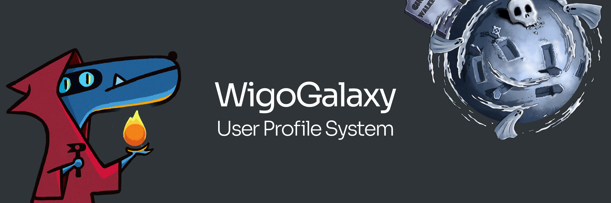

# 🌌 User Profile System (WigoGalaxy)

The user profile system is a powerful infrastructure in WigoSwap that allows users to create a decentralized user profile including a unique name and profile image (NFT). Each user in the user profile system (which we call WigoGalaxy) can become a member of a planet (including West World, Ghost Walkers, and Bored Planet) and participate in interplanetary competitions.

:arrow\_forward:[ Create a profile NOW!](https://wigoswap.io/join)
