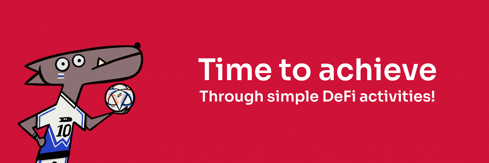
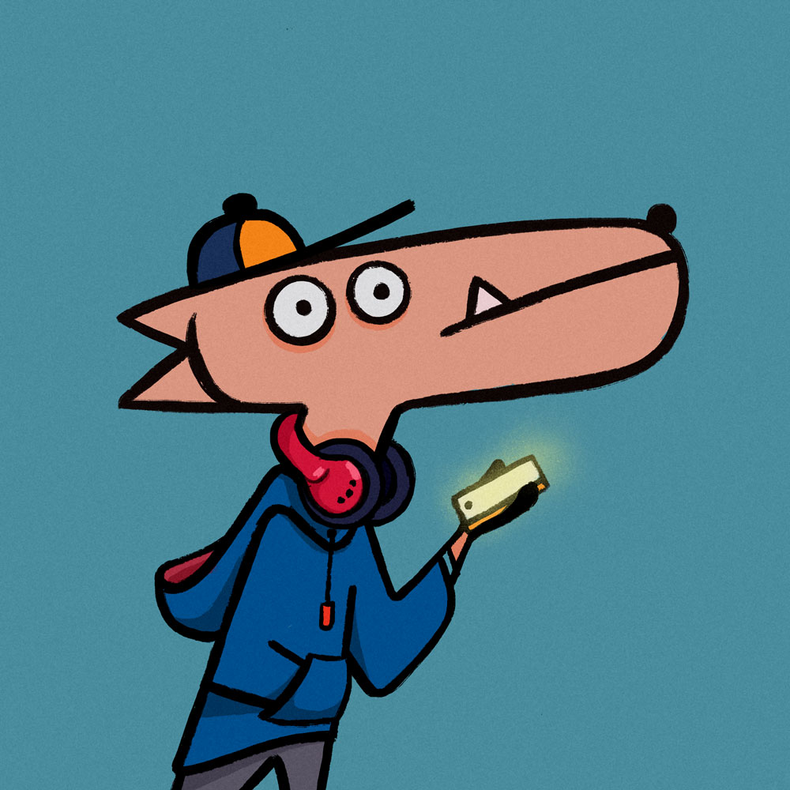
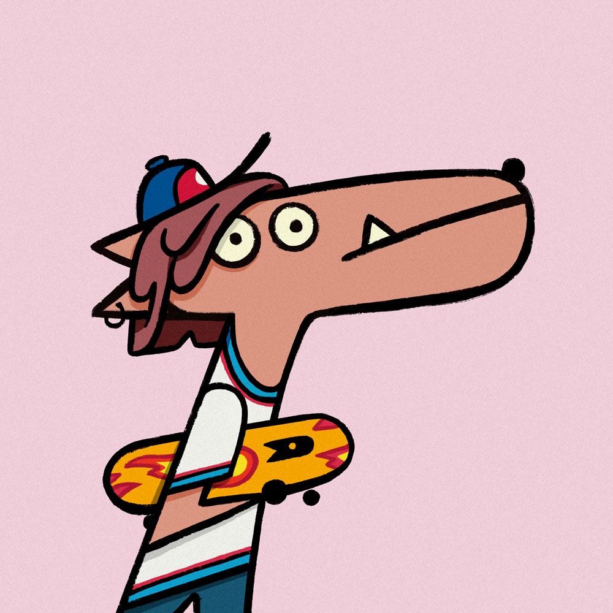
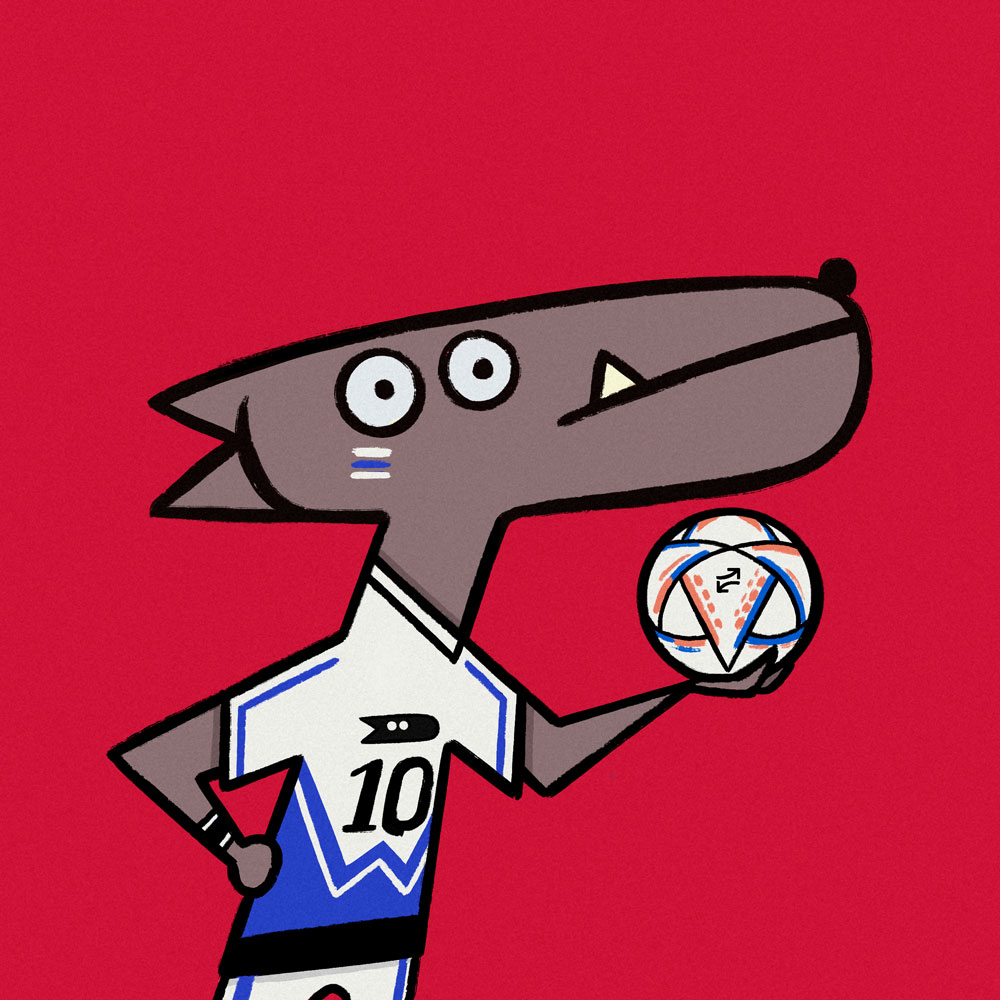
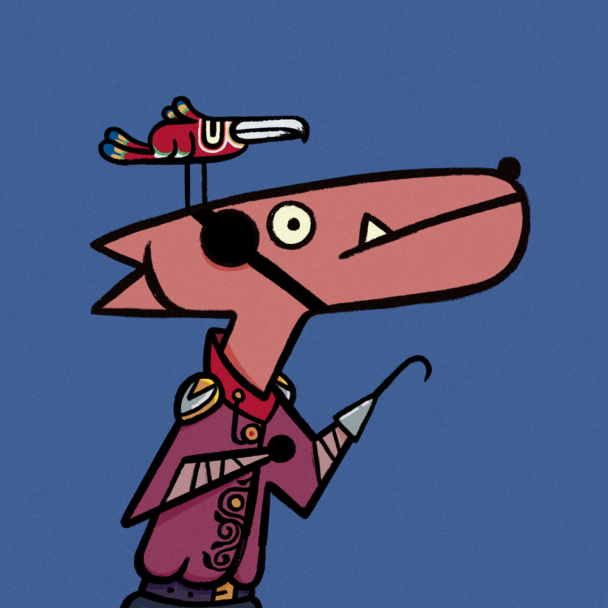

# Achievements & Points

<figure><figcaption></figcaption></figure>

Achievements (Special Wigggy NFTs) are one of the most attractive and exciting sections in WigoSwap, which can generate income for you. You can get points and achievements by doing certain activities.

To see the list of achievements, after [creating a profile](how-to-create-user-profile.md) in WigoSwap, go to the achievements section in your profile and find a complete list of attainable NFTs and how to get each one.

<figure><figcaption></figcaption></figure>

Also, you will be awarded a certain amount of points for each achievement. Points will soon be redeemable in parts of WigoSwap! In the following, we will explain some active achievements.&#x20;

<figure><figcaption>
<strong>Our cool Ghost Wiggy could be achieved whenever you invite at least 3 of your friends to live in the WigoGalaxy (Create a profile)! Find your referral link on your profile page.</strong> 
</figcaption></figure>

<figure><figcaption>
<strong>ZOMBIEEEEEE is yours if you collect 200 $WIGO to harvest from WIGO-FTM or WIGO-USDC farms. (Visit</strong> <a href="../yield-farming-wigofarm/"><strong>WigoFarm</strong></a><strong>)</strong> 
</figcaption></figure>

<figure><figcaption>
<strong>This cute Wiggy NFT is available for users who collect at least 100K WIGO to harvest from the</strong> <a href="../yield-farming-wigofarm/"><strong>WigoFarm</strong></a><strong>.</strong> 
</figcaption></figure>

<figure><figcaption>
<strong>Level up your experience to WigoAstral in our Discord server. Join our</strong> <a href="https://discord.com/invite/S6hNJ7WW6r"><strong>Discord server</strong></a> <strong>now!</strong> 
</figcaption></figure>

<figure><figcaption>
<strong>Are you a staker? So why don’t you claim your exciting Skater Wiggy? Earn at least 2K WIGO to collect from</strong> <a href="../staking-wigo-wigobank/"><strong>WigoBank's</strong></a> <strong>standard pool.</strong>
</figcaption></figure>

<figure><figcaption>
Just collect 200 WIGO to harvest from WIGO-FTM or WIGO-USDC farms!
</figcaption></figure>

<figure><figcaption>
Stake &#x26; lock-up at least 1000 FTM on Fantom validator nodes!
</figcaption></figure>

<figure><figcaption>
Participate in the automatic staking before Sep 20, 2022 10:00 AM UTC.
</figcaption></figure>

<figure><figcaption>
Collect at least 100 points in the WigoGalaxy!
</figcaption></figure>

<figure><figcaption>
Collect only 10 in pending WIGO rewards on LQDR-FTM farm!
</figcaption></figure>
