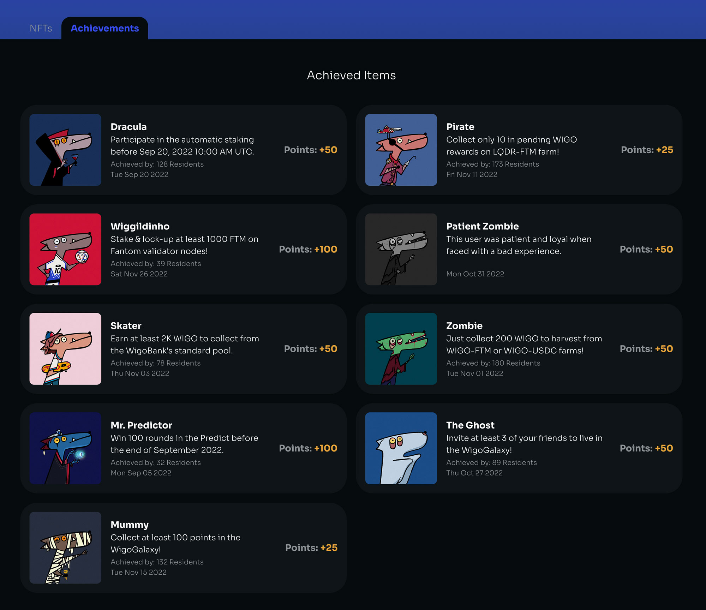

# 🎨 Wiggy (NFT)

<figure><figcaption></figcaption></figure>

Our lovely Wiggy added a new vibe to our products and community. Wiggy is designed by a master [artist](https://twitter.com/moreoddcandy) in our team and we are continuously developing this lovable character. Wiggies will also represent the personality of each resident of [WigoGalaxy](user-profile-system-wigogalaxy/) with an active profile. Every WigoGalaxy resident can mint a Wiggy NFT for their profile picture. This is just one of Wiggy's functions on the WigoSwap platform.\

Wiggy is developing every day and we are constantly creating and presenting new poses that will be gradually introduced and available to users. Currently, you can get Wiggy NFT in the following ways:

* [Creating a user profile](user-profile-system-wigogalaxy/how-to-create-user-profile.md) and minting your NFT profile.
* Also, by doing special activities on WigoSwap, users can claim special Wiggy NFTs, which we call [achievements](user-profile-system-wigogalaxy/achievements-and-points.md). Check your user profile section (achievements tab) to see the Wiggies that are accessible.

<figure><figcaption></figcaption></figure>

