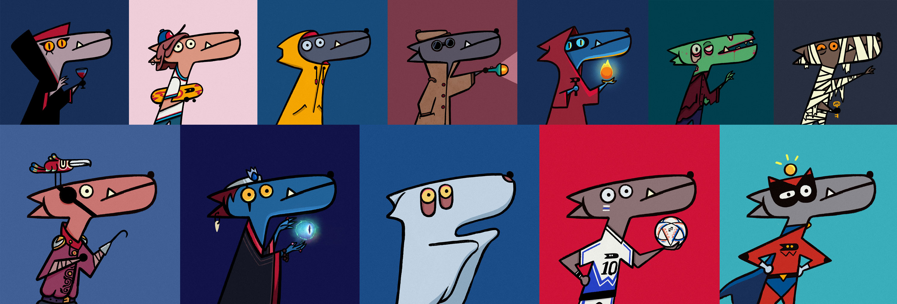

# 🧑🚀 Wiggies & Galactic Credits

<figure><figcaption></figcaption></figure>

Wiggies are unique NFTs that serve as companions in your WigoGalaxy journey. Each Wiggy has its characteristics, strengths, and can be leveled up over time by collecting and applying level-up assets. Wiggies also add a personal touch to your WigoGalaxy experience, as they represent your identity in this vast universe.

Galactic Credits are the main currency of the WigoGalaxy. They can be earned by completing quests, discovering hidden rewards, or trading on the Bazaar marketplace. Galactic Credits can be exchanged for NFTs, Wiggy upgrades, and more, making them an integral part of the WigoGalaxy economy.
