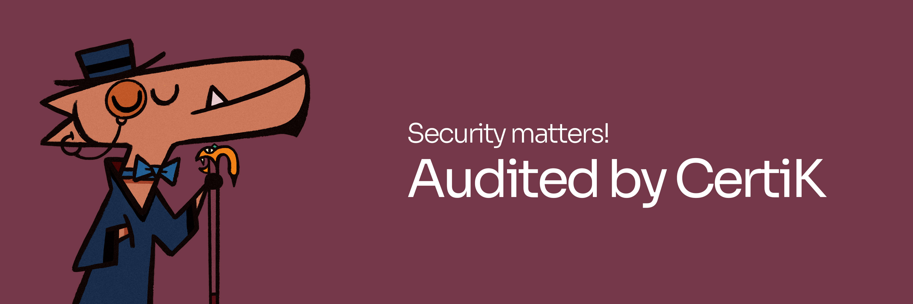

# 🔐 Security Audit Reports

At WigoSwap, we take the security of our platform and our users' assets extremely seriously. That's why we have undergone rigorous security audits of our code and smart contracts before the release of our platform to the public.

Our team of experienced security experts has meticulously examined every aspect of our platform, including our smart contracts, infrastructure, and operations, to ensure that they meet the highest industry standards for security. We have also implemented robust security measures such as multi-sig wallets, firewalls, and intrusion detection systems to protect against potential threats.

Our commitment to security doesn't stop there - we will continue to perform regular security audits and updates to ensure that our platform remains secure for our users. WigoSwap has been successfully audited by [CertiK](https://certik.com).&#x20;


**Read CertiK's full audit -->** [**https://www.certik.com/projects/wigoswap**](https://www.certik.com/projects/wigoswap)****



We encourage our users to also take steps to protect their own by using safe wallets, keeping keys in a safe place, and being cautious of phishing attempts.


We understand that trust is earned, not given. That's why we strive to be transparent about our security efforts and welcome any questions or feedback from our users. **Rest assured that with WigoSwap, your assets are in safe hands**.


