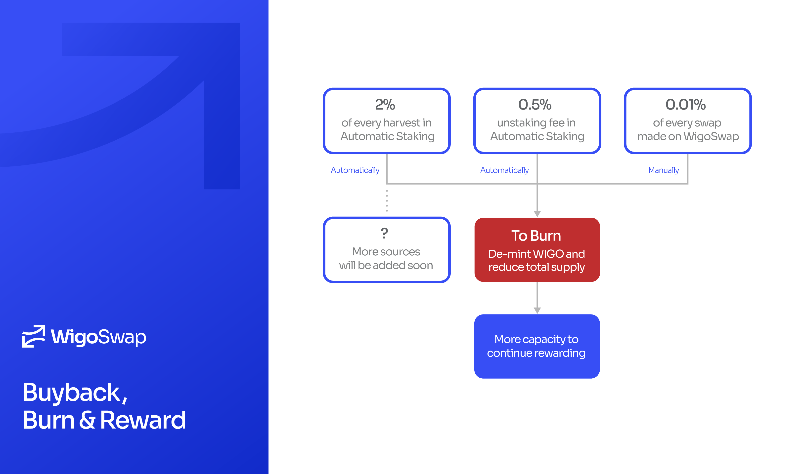

# Buyback, Burn & Reward!

Without rewards, there would be much less incentive to provide liquidity (LP fees etc. would remain). **There's a hard-cap on the supply of WIGO token: 2,000,000,000**. Therefore, we need a mechanism which prolongs the time to reach the hard-cap.

Buyback, Burn & Reward is a mechanism of WigoSwap that supports long term price stability and value growth, brings profits to WIGO holders and delays reaching the hard-cap.

> **The more activities, the longer rewards.**

By this mechanism, WigoSwap provides the possibility of minting new tokens through burning (de-minting) some of the circulating WIGO tokens to reduce total supply and continue rewarding farmers and stakers. The goal is for more WIGO to leave circulation than the amount of WIGO that's producing before reaching the hard-cap. We will get closer to this goal only by increasing the activities on the platform.

In the WIGO, the Total Supply can never exceed the hard-cap (Max Supply), and we have:

`Total Supply = Total Minted - Total Burned`

All three of the above variables are always accessible and readable in the WIGO Smart Contract.


[wigoswap-contracts.md](../smart-contracts/wigoswap-contracts.md)


Below are the current sources for Buyback, Burn & Reward mechanism:

* **2%** of every yield harvest in the [Automatic](../products/wigo-bank/automatic-vs.-standard.md) staking pool
* **0.01%** of every swap made on WigoSwap

More sources will be added in the near future.
