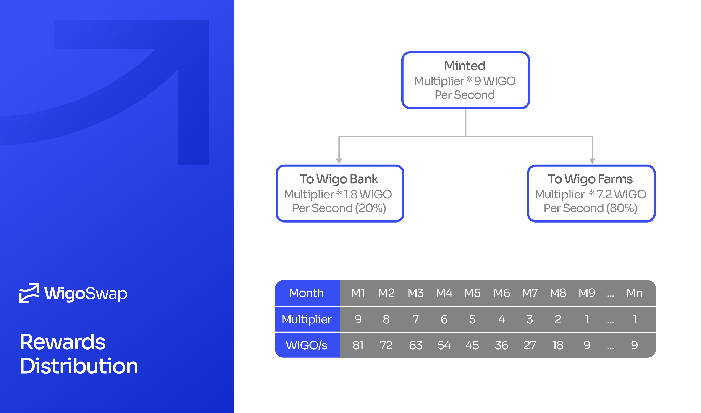

# 🎁 Rewards Distribution

The base emissions rate is 9 WIGO per second divided across WIGO staking and farming pools. WIGO minting features a mid-term hyperinflationary period of 8 months in which rewards have a 9 times multiplier in the first month and are reduced automatically every month afterward. All tokens minted in this period will be released immediately.

## Rewarding Schedule

<table><thead><tr><th width="150">Month</th><th width="150">Duration</th><th width="150">WIGO/s</th><th width="150">Rewards</th><th width="150">Total Rewards</th></tr></thead><tbody><tr><td>1</td><td>2,592,000 s</td><td>81</td><td>209,952,000</td><td>209,952,000</td></tr><tr><td>2</td><td>2,592,000 s</td><td>72</td><td>186,624,000</td><td>396,576,000</td></tr><tr><td>3</td><td>2,592,000 s</td><td>63</td><td>163,296,000</td><td>559,872,000</td></tr><tr><td>4</td><td>2,592,000 s</td><td>54</td><td>139,968,000</td><td>699,840,000</td></tr><tr><td>5</td><td>2,592,000 s</td><td>45</td><td>116,640,000</td><td>816,480,000</td></tr><tr><td>6</td><td>2,592,000 s</td><td>36</td><td>93,312,000</td><td>909,792,000</td></tr><tr><td>7</td><td>2,592,000 s</td><td>27</td><td>69,984,000</td><td>979,776,000</td></tr><tr><td>8</td><td>2,592,000 s</td><td>18</td><td>46,656,000</td><td>1,026,432,000</td></tr><tr><td>9</td><td>2,592,000 s</td><td>9</td><td>23,328,000</td><td>1,049,760,000</td></tr><tr><td>10</td><td>2,592,000 s</td><td>9</td><td>23,328,000</td><td>1,073,088,000</td></tr><tr><td>11</td><td>2,592,000 s</td><td>9</td><td>23,328,000</td><td>1,096,416,000</td></tr><tr><td>12</td><td>2,592,000 s</td><td>9</td><td>23,328,000</td><td>1,119,744,000</td></tr><tr><td>...</td><td>...</td><td>...</td><td>...</td><td>...</td></tr><tr><td>31</td><td>2,592,000 s</td><td>9</td><td>23,328,000</td><td>1,562,976,000</td></tr><tr><td>32</td><td>2,592,000 s</td><td>9</td><td>23,328,000</td><td>1,586,304,000</td></tr><tr><td>...</td><td>...</td><td>...</td><td>...</td><td>...</td></tr><tr><td>n</td><td>2,592,000 s</td><td>9</td><td>?</td><td>?</td></tr></tbody></table>

Although WIGO has a 2 billion hard cap, [Buyback, Burn & Reward](gamified-burning-mechanism-gbm.md) mechanism prolongs the time to reach the hard cap. Getting the hard cap will take about 33 months, assuming no tokens are burned. The more tokens burned, the more extended emissions, but the total supply of WIGO will never exceed the hard cap.

## **Why WIGO per Second?**

Reading the texts explaining the mechanism of the farms and the calculation of the emissions on WigoSwap, you might have asked yourself why the terminology “WIGO per second” is used rather than “WIGO per block”? The answer is simple; WigoSwap operates on the Fantom Blockchain, and on Fantom, transaction activities on the blocks determine the block time on the network. Therefore, the block time could range from less than one second to 20+ seconds.

But why is this important for WigoSwap’s ecosystem? Considering the farms where you stake your tokens to earn rewards, there is no significant difference between WigoSwap’s farms and the farms that use other chains. Nevertheless, regarding operations such as swapping, the Fantom Blockchain is outstanding and can outperform other chains. This is because, on the Fantom Blockchain, there is an inverse relationship between the number of transactions and the block times. In other words, increasing the number of transactions on the network leads to a decrease in block times. Consequently, users benefit from a faster transaction speed and a quicker trading experience.
