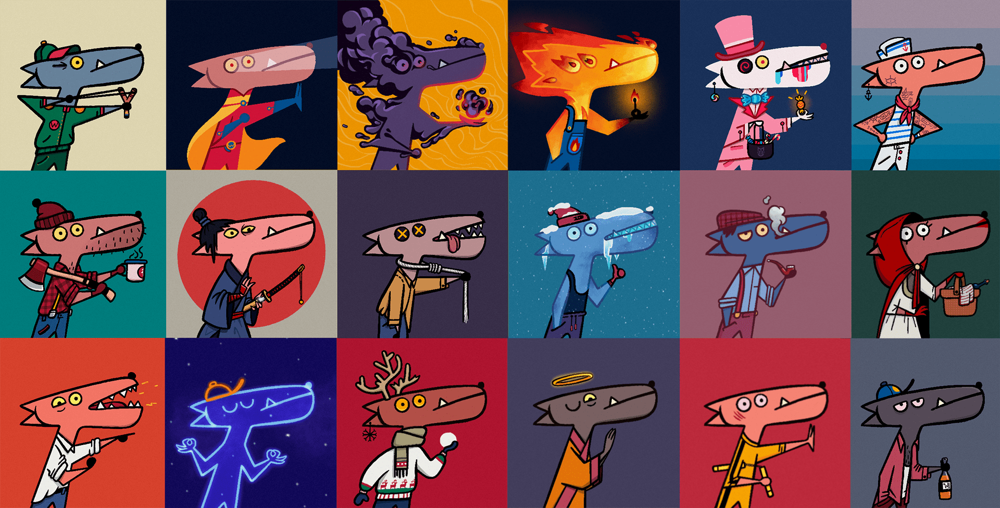

# 🦄 Rare Wiggies

<figure><figcaption></figcaption></figure>

The Wiggies serve as your faithful companions within the vast expanse of WiGalaxy. As Non-Fungible Tokens (NFTs), each Wiggy carries its unique traits and characteristics, providing users with a diverse range of digital companions to accompany them on their WiGalaxy journey. The Wiggies add vibrancy to the metaverse, partaking in adventures, engaging in narratives, and interacting with users in a myriad of exciting ways. But their value extends beyond mere companionship - they are a gateway to numerous rewards and experiences within the WiGalaxy, creating a fun and interactive way for users to explore the endless possibilities of the metaverse.

**Rare Wiggy: A Treasure Trove of Exclusivity, Rarity, and Value**

Within the diverse Wiggy universe lies a special class of Wiggies - the Rare Wiggies. As the name implies, these Wiggies are scarce and highly sought after, each possessing unique attributes and values that set them apart from the rest. But what makes Rare Wiggies truly special is the additional benefits and rewards they offer. Owners of Rare Wiggies enjoy exclusive advantages, such as access to special quests, priority in certain events, and even a larger share of rewards. This high level of exclusivity and potential profitability makes Rare Wiggies not only a thrilling element of the metaverse but also an enticing investment opportunity. With Rare Wiggies, WiGalaxy injects an added layer of excitement, adventure, and potential wealth creation into the Metaverse.
