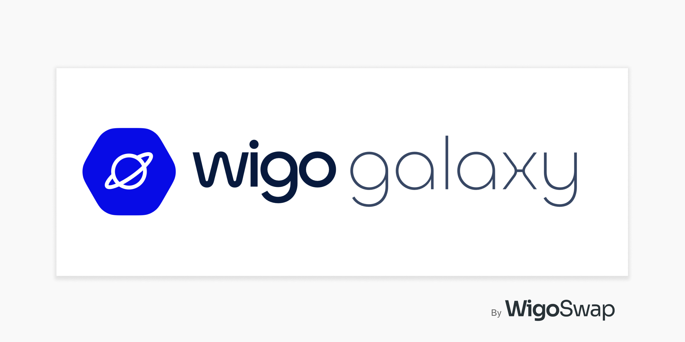

# 🌌 Overview

<figure><figcaption></figcaption></figure>

**Journey Beyond the Stars: Welcome to WiGalaxy**

Welcome to WiGalaxy, the imaginative Metaverse within the Wigo Ecosystem. As an ever-evolving, narrative-driven platform, WiGalaxy promises an unmatched user engagement experience that goes beyond typical blockchain functionalities. Here, blockchain meets imagination, spinning an expansive universe that offers an exhilarating exploration of uncharted territories, exciting quests, and valuable rewards. WiGalaxy represents an infinite canvas where users from all walks of life can learn, play, interact, and earn within an immersive blockchain environment.

**A Metaverse For All: Play, Learn and Earn**

WiGalaxy breaks the barriers of conventional blockchain platforms by integrating the innovative Play-to-Earn and Learn-to-Earn models. This pioneering approach ensures that WiGalaxy is not just a playground, but also an educational platform where users can earn rewards while acquiring blockchain knowledge. Whether you're a seasoned blockchain enthusiast or a novice explorer, WiGalaxy presents a seamless blend of fun and learning, cultivating an engaging community that grows together.

**Master the Game: A New Universe of Interaction**

WiGalaxy incorporates compelling game mechanics that ensure a continuous and thrilling user journey. From quests and missions tailored to each user's blockchain proficiency level, to exciting interactions with other users and characters, every step within WiGalaxy is designed to provide enriching experiences. With innumerable paths to choose and countless rewards to reap, WiGalaxy ensures a dynamic user experience that goes beyond the boundaries of traditional gaming and blockchain platforms.

**Unleashing the Power of NFTs: Meet the Wiggies**

Within the vibrant WiGalaxy Metaverse, users interact with unique characters known as Wiggies. These NFT-based companions come to life, partaking in adventures, narratives, and interactions. With the introduction of Rare Wiggies, WiGalaxy not only provides a novel form of art investment but also elevates the metaverse interaction to an entirely new level. By giving value to creativity and imagination, WiGalaxy stands as a testament to the limitless possibilities of the blockchain universe.

To join the beta version of WiGalaxy (WigoGalaxy) please register your username:

:arrow\_forward:[ Create a profile NOW!](https://wigoswap.io/join)
