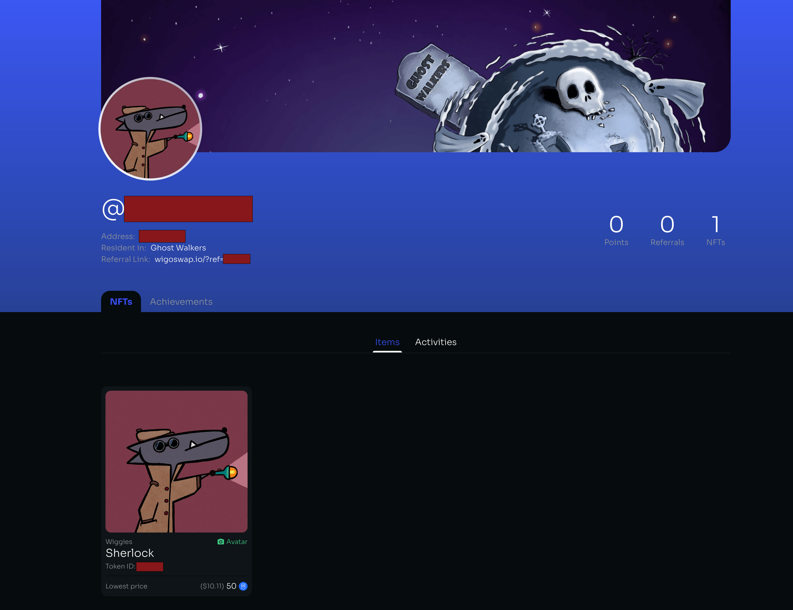

# 🚩 Land on WiGalaxy

Starting your adventure on WigoGalaxy is as simple as creating a decentralized account. As a new settler, you get to choose a planet to inhabit—each with its own unique characteristics and inhabitants. Additionally, you'll be assigned an initial Wiggy companion, a unique NFT that will accompany you throughout your journey in the WigoGalaxy.

Choosing quests to embark on is the next step. Each quest carries objectives which, when completed, earn you rewards ranging from Galactic Credits, Tokens, NFTs, Wiggy companions, to Wiggy level-up assets and more. Each decision you make shapes your journey and the rewards you reap.

Remember, WigoGalaxy is a vast universe filled with opportunities. The more you explore and interact, the more you can earn. Completing quests, finding hidden rewards, and trading on our Bazaar marketplace all contribute to your advancement in WigoGalaxy.


**To start creating a WiGalaxy profile please open this** [**link**](https://wigoswap.io/join)**.**&#x20;


\
<mark style="color:blue;">**Step 1: Minting your Wiggy (NFT Avatar)**</mark>

After connecting your wallet you should see a list of available Wiggies that you can mint in the process and choose as your initial Wiggy avatar. Select whichever you like most! Click on “Enable” to give access to WiGalaxy to interact with your wallet. After that click on “Confirm” to confirm the process in your wallet.&#x20;

<figure><figcaption></figcaption></figure>

\
<mark style="color:blue;">**Step 2: Selecting Wiggy as your avatar**</mark>

Now you have successfully minted and owned your Wiggy, next you can see your Wiggy and select it as your profile pic. In this step by clicking on “Enable” you will lock your NFT on WigoSwap to be able to use it as your avatar. Don’t worry, you can unlock it whenever you want. Now click on the next step.

<figure><figcaption></figcaption></figure>

\
<mark style="color:blue;">**Step 3: Choosing your planet!**</mark>

Creating a profile on WigoSwap is in fact the process of joining WigoGalaxy, so every new user should select a planet as their home! There’s currently no significant difference between planets, so pick whichever one you like! It won’t be possible to undo your choice for the foreseeable future!

<figure><figcaption></figcaption></figure>

\
\
<mark style="color:blue;">**Step 4: Choose your nickname**</mark>

What should we call you on WigoGalaxy? Choose your preferred username. This nickname will be shown in planet leaderboards and search results if your profile is active. Your name must be at least 3 and at most 15 standard letters and numbers long. You can’t change this once you click Confirm.

<figure><figcaption></figcaption></figure>


**Note: People can find your wallet address if they know your nickname or referral ID. So please be careful about this and agree with that by enabling the warning check box.**&#x20;


\
\
Click “Confirm” to approve your username through your wallet. Your username is submitted and the last action is clicking on “Complete Profile” → “Enable” & “Confirm” to pay the profile creation fee. \

\
**Congrats! Your WiGalaxy profile is now live! Enjoy.**\

<figure><figcaption></figcaption></figure>
