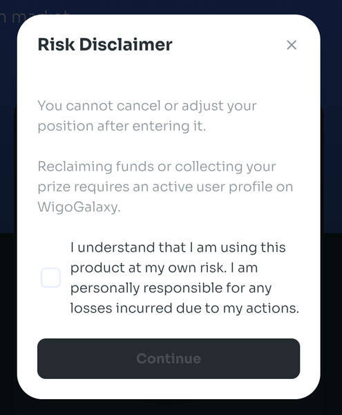
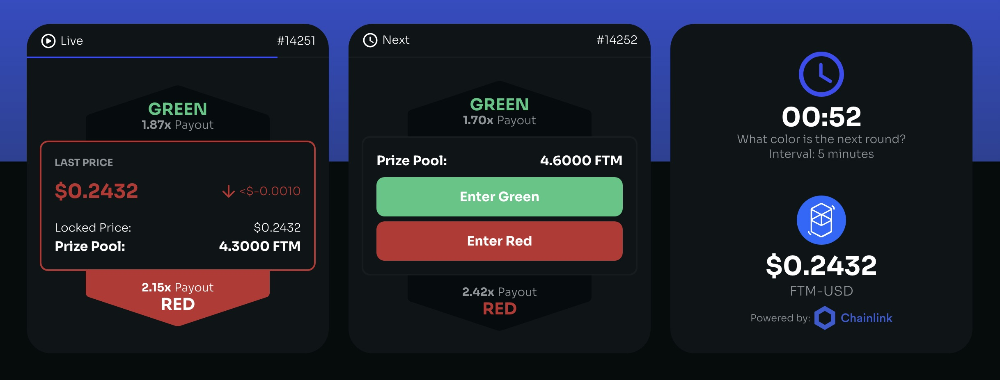
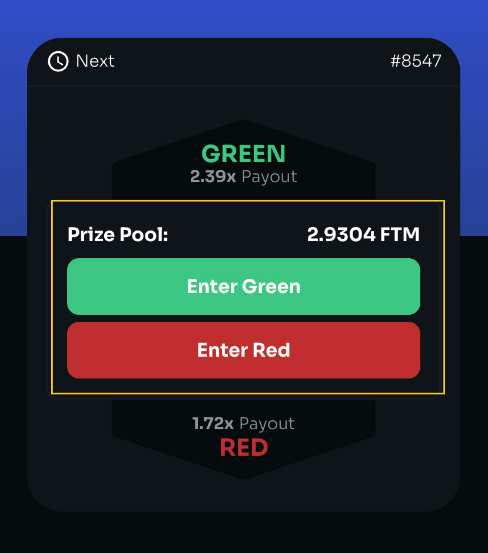
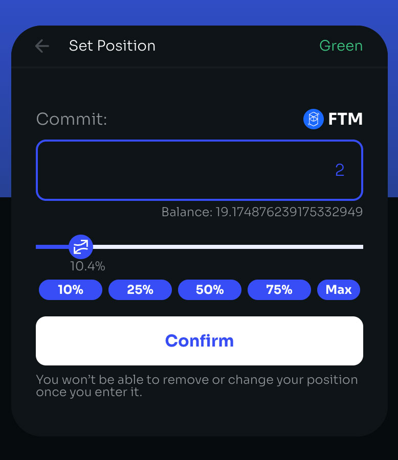
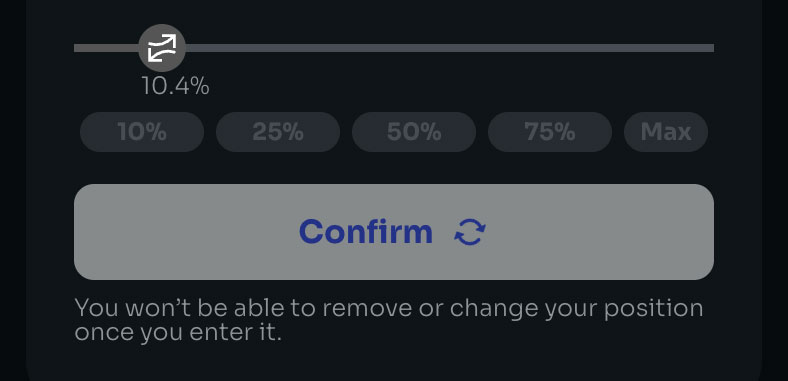
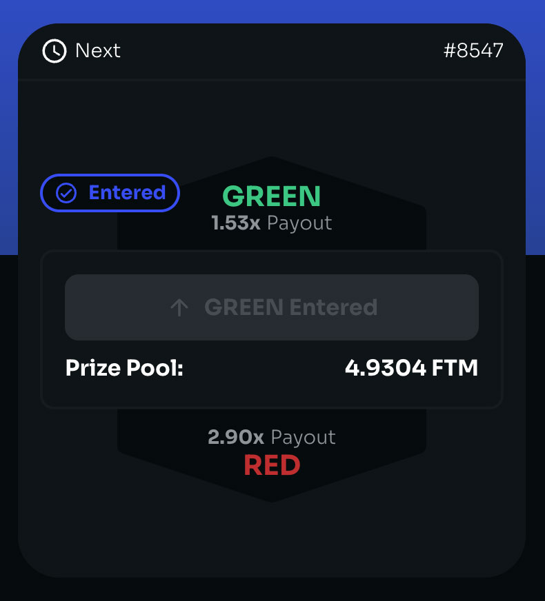
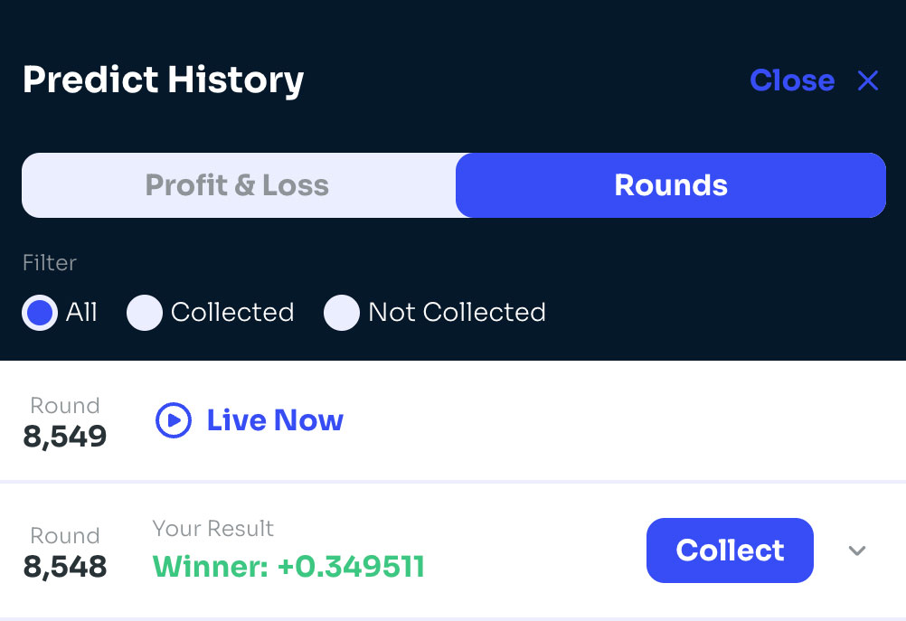
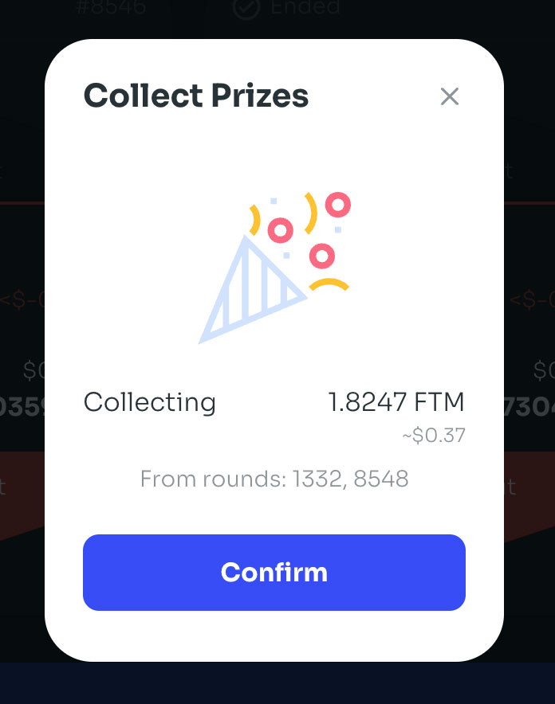
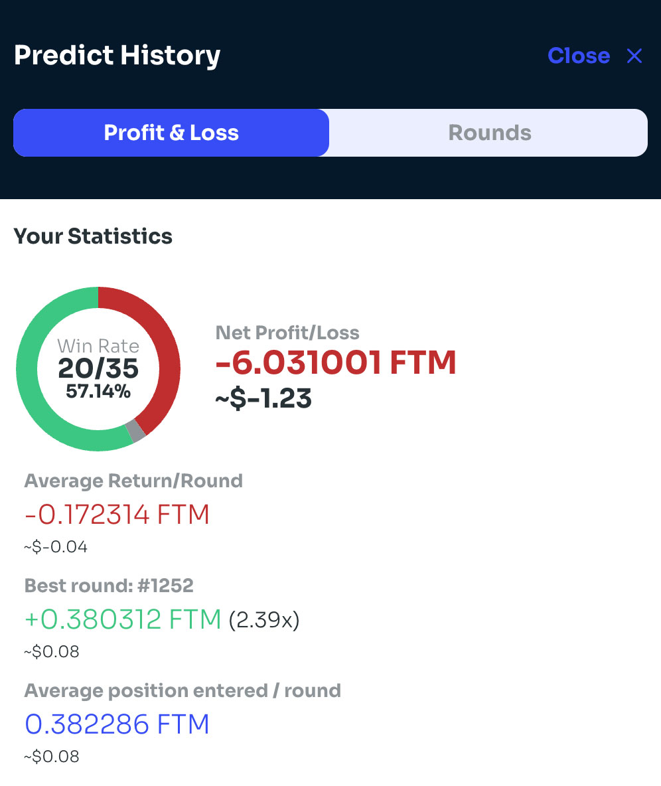

# How to use Predict

WigoSwap's Predict is a decentralized, simple, and fun game that lets users test their foresight to earn rewards. Predict if the FTM-USD price will go up or down, and you'll collect a share of the round's prize pool!\


Predict is a new product and works in the beta phase. As a result, we may make changes in the future to improve it. We will inform users of any changes impacting how the Predict works.


## Accepting the terms

<figure><figcaption></figcaption></figure>

Before using Predict, you’ll need to review and accept the terms. Read and accept the conditions and click **Continue**.

## Predicting the next round

The Predict page shows quite a bit of information. Predictions operate in 5-minute rounds. Make your prediction before a round goes live.

### Checking the timer

To enter a round, you'll need to check how long is left in the live round. There is a timer in the top-right area.

<figure><figcaption></figcaption></figure>

If the timer is too low, your prediction may not confirm in time. So check there's still enough time left before you make a prediction (30 seconds should be enough, but give yourself more time if you're following along with this guide).\

### Predicting the next round

When you're sure you have enough time, you can place your prediction for the next round.

1\. In the "Next" section, you'll see an <mark style="color:green;">**Enter Green**</mark> button and an <mark style="color:red;">**Enter Red**</mark> button. Click <mark style="color:green;">**Enter Green**</mark> if you want to predict a price rise, and click <mark style="color:red;">**Enter Red**</mark> if you want to predict a price drop.

<figure><figcaption></figcaption></figure>

Each will have a different reward multiplier. The multiplier will change over time as the "Prize Pool" increases depending on people's predictions. The Prize Pool is shown just above the buttons.

We'll choose <mark style="color:green;">**Green**</mark> for this example.

2\. A new window will open. You'll see "Commit" to commit FTM in the window for your prediction. Type the number of tokens you want to commit to your prediction for this round in the field. \

<figure><figcaption></figcaption></figure>

3\. Once you've decided the amount to commit, click **Confirm** and confirm your action in your wallet.

The confirm button will fade out as your transaction confirms. This short wait is why we checked the round timer earlier to make sure we would have time to make our prediction.

<figure><figcaption></figcaption></figure>

4\. After your transaction confirms, an "ENTERED" message will appear.

<figure><figcaption></figcaption></figure>

There's nothing left to do now but wait for your Predict round to go live.

## While your entered round is live

A live round will last for 5 minutes. You can watch the price update for 5 minutes if you'd like.&#x20;

You cannot change your prediction during a live round, however. You are locked into your prediction from earlier.

## Once your entered round finishes

After 5 minutes of the live round, your entered round will finish. Everything is automatic, so there's nothing you need to do to end the round.

### Seeing the results

1\. As the 5 minutes finish, the "Live" section will change to "Calculating". Calculating the results takes a short moment.

<figure><figcaption></figcaption></figure>

2\. After a short wait, the finished round will move and say "Ended". The round result will display either <mark style="color:green;">**GREEN**</mark> colored in up or <mark style="color:red;">**RED**</mark> colored in down.\

3\. If you've been busy and missed the results, you can scroll back a few rounds.

### Seeing results for older rounds

If you want to see the results for rounds you've entered that are older than a few rounds, you'll need to follow the steps below to find the results.

1\. Click on the **History** button.

<figure><figcaption></figcaption></figure>

2\. A "Predict History" panel will open. Click the **Rounds** tab. By default, you should see your most recent round at the top of the list. Click anywhere on the round to see more information.

<figure><figcaption></figcaption></figure>

### Collecting any winnings

1\. If you won your entered round, a **Collect Prizes** button would appear. Click the button.

<figure><figcaption></figcaption></figure>

2\. A new window will appear showing the amount of winnings you can collect with a **Confirm** button. Click the button and confirm the action in your wallet.

Your token winnings will now be in your wallet.

###

### Collecting prizes from older rounds

Sometimes you may be away from WigoSwap's Predict page for a while or may have forgotten to collect prizes from older rounds. You can still collect winnings owed to you from older rounds at any time.

1\. Find more information on past rounds you've entered by clicking on the **History** button.

2\. A "Predict History" panel will open. Click the **Rounds** tab. You can click "Not Collected" to view all rounds you've not collected the winnings yet (click the transaction if you want to see more details). Click the **Collect** button.

3\. A new window will appear showing the amount of winnings you can collect with a **Confirm** button. Click the button and confirm the action in your wallet.

Your prizes will now be in your wallet.

## Viewing historical profit and loss data

If you'd like to see how you've done in Predict, you can view PNL (Profit and Loss) data whenever.

1\. On the Prediction page, click the **History** button. A "Predict History" panel will open.

2\. On the Predict History panel, click the **Profit & Loss** tab.

<figure><figcaption></figcaption></figure>

The tab will open with stats for your historical performance in Predict, including your net results, average return, best round, and other information.

3\. You can click the **View Details** button at the bottom of the **Profit & Loss** tab to view those transactions on the FTMScan explorer.

