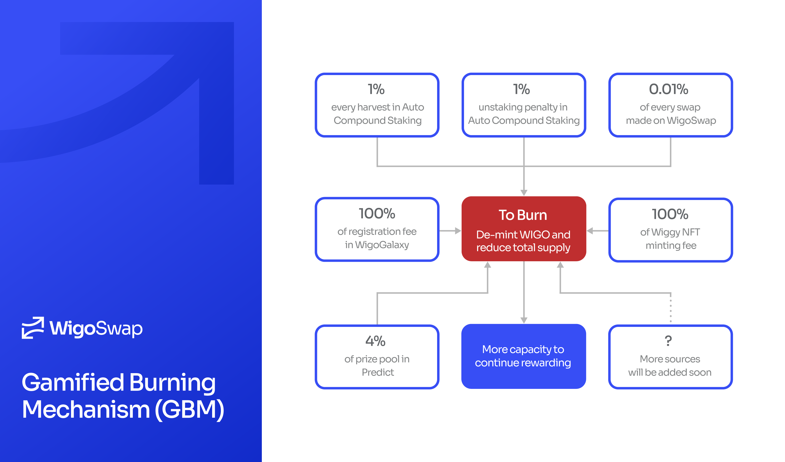

# 🔥 Galaxy Burning Module (GBM)

The Galaxy Burning Module (GBM), initially known as the Gamified Burning Mechanism, is a standout feature of WigoSwap. Introduced as an innovative tool to ensure the longevity and sustainability of the $WIGO token, GBM has successfully proven itself as a key measure for controlling token inflation. By gamifying the burning process, GBM incentivizes user engagement and fosters economic stability across the Wigo Ecosystem.

**Prolonging Incentives: The Core Functionality of GBM**

Liquidity provision would lack allure without substantial rewards. Given the finite supply of WIGO tokens, capped at 2,000,000,000, a mechanism is needed to extend the time until the hard cap is reached. This is where GBM comes into play. The GBM not only supports long-term price stability and value growth but also enriches WIGO holders and delays reaching the hard cap through its intricate design. The more activity on WigoSwap, the longer the incentives last. This is achieved by simultaneously burning (de-minting) some of the circulating WIGO tokens and minting new ones, hence reducing the total supply. This mechanism targets a balance where more WIGO leaves circulation than the amount of WIGO that's minted before reaching the hard cap.

**Sustaining a Healthier Ecosystem: The GBM Impact**

GBM forms the beating heart of the Wigo Ecosystem. By gamifying token burning and tying it to user activity, GBM encourages users to actively engage with the ecosystem, earn rewards, and contribute to the overall health of the Wigo economy. Furthermore, the transparency of the WIGO Smart Contract allows users to readily access and read the total supply, total minted, and total burned figures. With a cap on the total supply, which can never exceed the hard cap, these variables become a testament to the operational integrity of WigoSwap. Through GBM, WigoSwap not only ensures token sustainability but also cultivates a prosperous, engaging, and user-centric ecosystem.

All the above variables are always accessible and readable in WIGO smart contract.


[wigoswap-contracts.md](../smart-contracts/wigoswap-contracts.md)


Below are the sources for Gamified Burning Mechanism:

* **1%** of every harvest in the [Staking pool](../products/staking-wigo-wigobank/automatic-vs.-standard.md) (Auto Compound Performance Fee) in the WigoBank.
* **1%** of every unstake within three days in the [Staking pool](../products/staking-wigo-wigobank/automatic-vs.-standard.md) (Auto Compound) in the WigoBank.
* **0.01%** of every swap made on [WigoSwap](../products/swap/). Buy back WIGO and burn it manually every week through the wigoBurn function in the MasterFarmer smart contract.
* **100%** of registeration fee in [WigoGalaxy](../wigalaxy-the-metaverse/wigalaxy-overview/)
* **100%** of [Wiggy NFT](broken-reference) minting fee
* **4%** of prize pool in [Predict](../products/predict-mini-game/)
* **100%** trading fee in [WigoMarket](../products/bazaar-nft-marketplace/)

More sources will be added in the near future.

